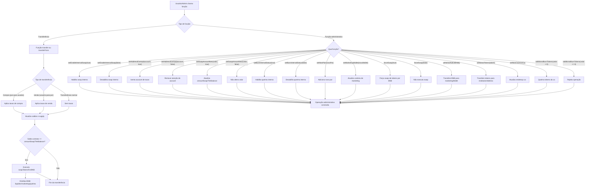

# RAM TECH Token (RAM_CEO_TOKEN)

## Visão Geral

O contrato `RAM_CEO_TOKEN` é um token BEP20/ERC20 avançado, desenvolvido para operar na Binance Smart Chain (BSC), com funcionalidades de taxas dinâmicas, liquidez automatizada, queima de tokens, controle administrativo e integração com PancakeSwap.

---

## Funcionalidades Principais

- **Taxas de Compra e Venda**: Taxas configuráveis para operações de compra e venda.
- **Taxa de Liquidez**: Parte das taxas é usada para adicionar liquidez automaticamente.
- **Taxa de Queima (Burn)**: Tokens são queimados em cada transação, reduzindo o supply.
- **Carteira de Marketing**: Parte das taxas é enviada para uma carteira de marketing.
- **Controle de Swap Interno**: O contrato pode trocar tokens acumulados por BNB automaticamente.
- **Administração Segura**: Funções administrativas separadas entre owner e admin.
- **Exceções de Taxa**: Endereços podem ser isentos de taxas.
- **Limite de Queima**: Não permite que o supply caia abaixo de 21 milhões de tokens em queimas automáticas.
- **Gestão de Pares**: Suporte a múltiplos pares de liquidez.

---

## Variáveis Importantes

- `buyFee`, `sellFee`, `burnFee`, `liquidityFee`: Taxas percentuais (em relação ao denominador, padrão 100).
- `marketingWallet`: Endereço que recebe a taxa de marketing.
- `admin`, `ca`: Endereços administrativos para funções sensíveis.
- `enableInternalSwap`: Habilita/desabilita o swap automático de tokens por BNB.
- `burnInternal`: Habilita/desabilita a queima interna de tokens.
- `amountSwapTheBalance`: Quantidade de tokens que, ao ser atingida no contrato, dispara o swap automático.
- `stopBurnTx`: Supply mínimo para queima automática (21 milhões de tokens).
- `newPair`: Lista de pares adicionais de liquidez.

---

## Funções Principais

### Funções BEP20/ERC20
- `transfer`, `transferFrom`, `approve`, `allowance`, `balanceOf`, `totalSupply`, `decimals`, `symbol`, `name`

### Funções de Taxa/Administração
- `setBuyFee(uint256)`, `setSellFee(uint256)`, `setLiquidityFee(uint256)`, `setBurnFee(uint256)`
- `setEnableInternalSwap(bool)`, `setAddressExempt(address,bool)`, `setSwapAmountNew(uint256,bool)`, `setBurnInternalStatus(bool)`
- `setNewPair(address)`, `setMarketingWallet(address)`, `forceSwap(bool)`, `withdrawNativeBNB()`, `withdrawTokens(address)`, `setNewCa(address)`, `additionalBurnTokens(uint256)`

### Lógica de Transferência
- **Compra**: Taxas deduzidas do destinatário.
- **Venda**: Taxas deduzidas do remetente.
- **Transferência normal**: Sem taxas.
- **Swap automático**: Quando o saldo do contrato atinge `amountSwapTheBalance`, tokens são trocados por BNB, parte vai para liquidez, parte para marketing e pode haver queima.

---

## Controle de Acesso
- **Owner**: Pode ativar/desativar trading e ajustar taxas.
- **Admin**: Pode executar funções de swap, isenção, ajuste de pares, marketing, queima adicional, etc.
- **Exceções**: Endereços podem ser isentos de taxas e restrições.

---

## Eventos
- Diversos eventos para rastrear mudanças de taxas, swaps, queimas, adição de liquidez, retiradas, etc.

---

## Fluxograma Detalhado do Funcionamento do Contrato

---

## Observações
- O contrato não utiliza Permit2, UniversalRouter ou qualquer padrão de aprovação avançada.
- Todas as interações externas são com PancakeSwap (router, factory) e contratos BEP20.
- Comentários e mensagens de erro estão em inglês, conforme convenção do projeto.

---

## Contato do Desenvolvedor
- Telegram: https://t.me/AbraaoOliveira47
- Facebook: https://www.facebook.com/xXPerfiladorXx
- WhatsApp: (74) 9 9194-3796

---

## Licença
MIT
