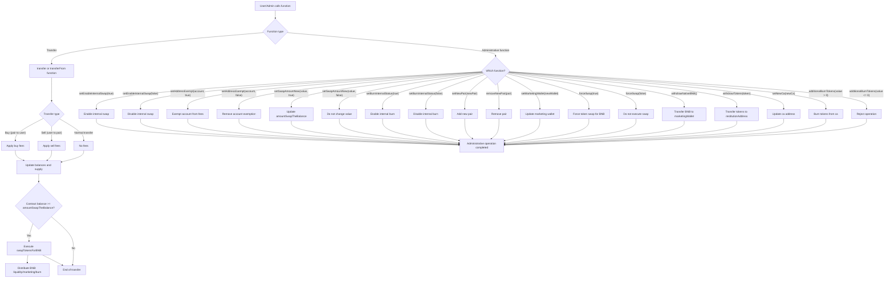

# RAM TECH Token (RAM_TECH_TOKEN)

## Overview

The `RAM_TECH_TOKEN` contract is an advanced BEP20/ERC20 token designed to operate on the Binance Smart Chain (BSC), featuring dynamic fees, automated liquidity, token burning, administrative control, and PancakeSwap integration.

---

## Main Features

- **Buy and Sell Fees**: Configurable fees for buy and sell operations.
- **Liquidity Fee**: Part of the fees is used to automatically add liquidity.
- **Burn Fee**: Tokens are burned in each transaction, reducing the supply.
- **Marketing Wallet**: Part of the fees is sent to a marketing wallet.
- **Internal Swap Control**: The contract can automatically swap accumulated tokens for BNB.
- **Secure Administration**: Administrative functions are separated between owner and admin.
- **Fee Exemptions**: Addresses can be exempted from fees.
- **Burn Limit**: The supply cannot fall below 21 million tokens through automatic burns.
- **Pair Management**: Supports multiple liquidity pairs.

---

## Important Variables

- `buyFee`, `sellFee`, `burnFee`, `liquidityFee`: Percentage fees (relative to the denominator, default 100).
- `marketingWallet`: Address that receives the marketing fee.
- `admin`, `ca`: Administrative addresses for sensitive functions.
- `enableInternalSwap`: Enables/disables automatic token swap for BNB.
- `burnInternal`: Enables/disables internal token burning.
- `amountSwapTheBalance`: Amount of tokens that, when reached in the contract, triggers the automatic swap.
- `stopBurnTx`: Minimum supply for automatic burning (21 million tokens).
- `newPair`: List of additional liquidity pairs.

---

## Main Functions

### BEP20/ERC20 Functions
- `transfer`, `transferFrom`, `approve`, `allowance`, `balanceOf`, `totalSupply`, `decimals`, `symbol`, `name`

### Fee/Administration Functions
- `setBuyFee(uint256)`, `setSellFee(uint256)`, `setLiquidityFee(uint256)`, `setBurnFee(uint256)`
- `setEnableInternalSwap(bool)`, `setAddressExempt(address,bool)`, `setSwapAmountNew(uint256,bool)`, `setBurnInternalStatus(bool)`
- `setNewPair(address)`, `setMarketingWallet(address)`, `forceSwap(bool)`, `withdrawNativeBNB()`, `withdrawTokens(address)`, `setNewCa(address)`, `additionalBurnTokens(uint256)`

### Transfer Logic
- **Buy**: Fees are deducted from the recipient.
- **Sell**: Fees are deducted from the sender.
- **Normal Transfer**: No fees.
- **Automatic Swap**: When the contract balance reaches `amountSwapTheBalance`, tokens are swapped for BNB, part goes to liquidity, part to marketing, and burning may occur.

---

## Access Control
- **Owner**: Can enable/disable trading and adjust fees.
- **Admin**: Can execute swap, exemption, pair adjustment, marketing, additional burn, etc.
- **Exemptions**: Addresses can be exempted from fees and restrictions.

---

## Events
- Various events to track fee changes, swaps, burns, liquidity addition, withdrawals, etc.

---

## Detailed Contract Flowchart



---

## Notes
- The contract uses a custom and innovative protection against race conditions, which first sets the approval amount to 0 if `_amount` is different from 0 or if the previously approved value between the owner and the spender is not 0.

- The approve function has custom reentrancy protection using the nonReentrantGuard modifier:

```solidity
function approve(address spender, uint256 amount) external nonReentrantGuard override returns (bool) {
    require(spender != address(0), "BEP20: approve to the zero address");
    if(amount !=0 && _allowances[_msgSender()][spender] != 0) {
       //first approve must be zero
        _approve(_msgSender(), spender, 0);
    }
    _approve(_msgSender(), spender, amount);
    return true;
}
```
- All external interactions are with PancakeSwap (router, factory) and BEP20 contracts.
- Comments and error messages are in English, as per project convention.

---

## Developer Contact
- Telegram: https://t.me/AbraaoOliveira47
- Facebook: https://www.facebook.com/xXPerfiladorXx
- WhatsApp: (74) 9 9194-3796

---

## License
MIT
