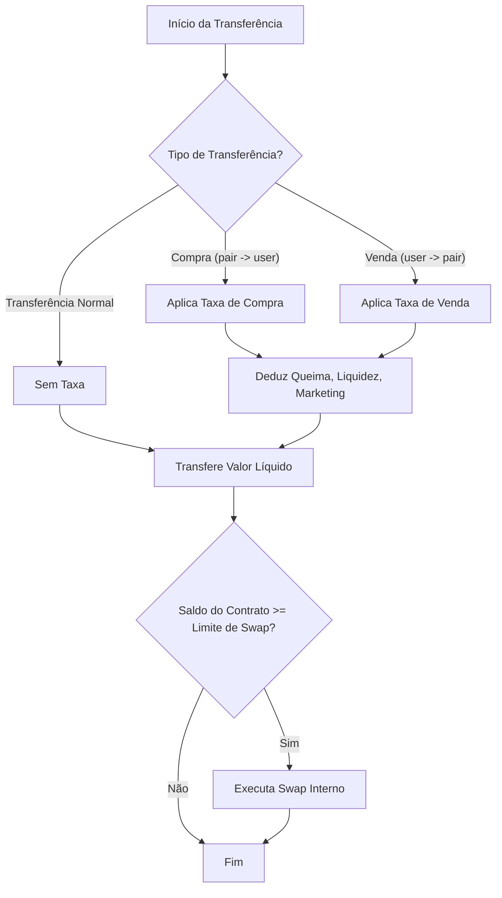

# RAM TECH Token (RAM)

## Visão Geral

O contrato **RAM TECH Token (RAM)** é um token BEP20/ERC20 desenvolvido para operar na Binance Smart Chain (BSC), com recursos avançados de controle de taxas, liquidez, swap interno, queima de tokens, administração e proteção para investidores. O contrato foi projetado para ser transparente, seguro e flexível, permitindo ajustes administrativos sem comprometer a segurança dos holders.

---

## Funcionalidades Principais

- **Compatibilidade BEP20/ERC20**: Implementa todas as funções padrão de um token BEP20/ERC20.
- **Taxas de Compra e Venda**: Taxas configuráveis para operações de compra e venda.
- **Taxa de Queima e Liquidez**: Parte das taxas é destinada à queima de tokens e à adição de liquidez.
- **Swap Interno**: Conversão automática de tokens acumulados em BNB para a carteira de marketing.
- **Administração Segura**: Funções administrativas restritas ao owner e ao admin, com controle de permissões.
- **Exceções de Taxas**: Endereços podem ser isentos de taxas.
- **Limite de Queima**: Proteção para não queimar além do mínimo definido (21M tokens).
- **Gestão de Pares**: Suporte a múltiplos pares de liquidez.
- **Eventos**: Emissão de eventos detalhados para monitoramento de todas as ações relevantes.

---

## Fluxo de Transferência

---

## Estrutura do Contrato

- **Interfaces**: IPancakeFactory, IPancakeRouter, IBEP20
- **Heranças**: Context, Ownable, nonReentrant
- **Variáveis Importantes**:
  - `totalSupply`: Suprimento total (500M RAM)
  - `buyFee`, `sellFee`, `burnFee`, `liquidityFee`: Taxas configuráveis
  - `marketingWallet`: Carteira de marketing
  - `admin`, `ca`: Endereços administrativos
  - `enableInternalSwap`, `burnInternal`: Flags de controle
  - `amountSwapTheBalance`: Limite para swap automático
  - `stopBurnTx`: Limite mínimo de supply para queima
  - `newPair`: Lista de pares adicionais

---

## Funções Administrativas

- `setTradingStatus(bool)`: Habilita/desabilita trading
- `setBuyFee(uint256)`, `setSellFee(uint256)`, `setLiquidityFee(uint256)`, `setBurnFee(uint256)`: Ajusta taxas
- `setEnableInternalSwap(bool)`: Habilita/desabilita swap interno
- `setAddressExempt(address, bool)`: Define isenção de taxas
- `setSwapAmountNew(uint256, bool)`: Ajusta limite de swap
- `setBurnInternalStatus(bool)`: Habilita/desabilita queima interna
- `setNewPair(address)`: Adiciona novo par de liquidez
- `setMarketingWallet(address)`: Altera carteira de marketing
- `forceSwap(bool)`: Força swap manual
- `withdrawNativeBNB()`: Retira BNB acumulado
- `withdrawTokens(address)`: Retira tokens acumulados
- `setNewCa(address)`: Altera endereço admin secundário
- `additionalBurnTokens(uint256)`: Queima tokens manualmente (admin)

---

## Segurança

- **Reentrância**: Uso do modificador `nonReentrantGuard`.
- **Permissões**: Funções sensíveis restritas ao owner ou admin.
- **Limite de Queima**: Não permite que o supply caia abaixo de 21M tokens.
- **Exceções**: Endereços críticos são isentos de taxas.

---

## Eventos

O contrato emite eventos para todas as ações administrativas e operacionais relevantes, facilitando o monitoramento e auditoria.

---

## Contatos do Desenvolvedor

- **Telegram**: https://t.me/AbraaoOliveira47
- **Facebook**: https://www.facebook.com/xXPerfiladorXx
- **WhatsApp**: (74) 9 9194-3796
- **Dev**: Abraao da Silva Oliveira (CPF: 076.600.285-37)

---

## Observações Finais

- O owner renuncia a propriedade após o lançamento, restando apenas funções administrativas seguras ao admin.
- O contrato foi projetado para máxima transparência e proteção dos investidores.
- Todas as taxas e parâmetros podem ser ajustados dentro de limites seguros.

---

## Licença

MIT
